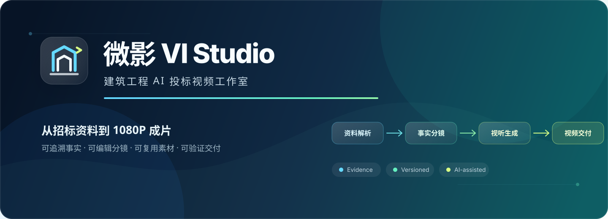
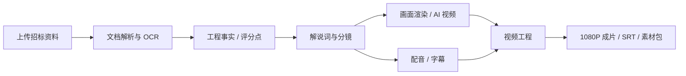

<div align="center">



# FastVideo

### 建筑工程 AI 投标视频平台

从招标资料到 1080P 成片，把文档理解、事实核验、分镜、画面、配音与视频合成连接成一条可追溯的生产链路。

[](frontend/package.json)
[](frontend/tsconfig.json)
[](backend/requirements.txt)
[](backend/Dockerfile)
[](docker-compose.yml)
[](#测试与构建)

[核心能力](#核心能力) · [产品工作流](#产品工作流) · [快速开始](#快速开始) · [AI 服务](#ai-服务配置) · [项目结构](#项目结构)

</div>

---

## 项目简介

FastVideo 面向建筑施工企业的投标视频制作场景。系统读取 PDF、DOCX、TXT 等项目资料，提取带来源的工程事实与评分点，辅助生成解说词和分镜，再完成建筑画面渲染、AI 视频、配音、字幕及多分段合成，最终导出 **16:9 / 1080P / H.264 MP4**。

项目重点不是简单地“让 AI 生成一段视频”，而是让每个关键结论能够回到资料原文，让每个画面、配音和视频版本能够被选择、恢复和追踪。

> [!IMPORTANT]
> AI 画面仅用于视觉表达。正式投标前仍需人工复核楼层、轮廓、道路、设备位置、工程参数和音色授权状态。

## 核心能力

| 模块 | 能力 |
| --- | --- |
| 文档与证据 | PDF / DOCX / TXT 解析、扫描页 OCR、表格与目录提取、SHA-256 去重、最大 1GB 断点续传 |
| 工程事实台账 | 面积、工期、日期、高度、层数、金额与评分项等关键参数提取；保留页码、原文、冲突和人工确认状态 |
| 解说词与分镜 | 基于已确认事实生成 3～5 分钟解说词，拆分为可编辑分镜，并统计评分点覆盖情况 |
| 建筑画面制作 | 模型截图渲染、12 种预设、局部重绘、扩图、清晰度增强、版本对比及分镜绑定 |
| AI 视频生成 | 42 种建筑视频模板，支持首帧、首尾帧和多参考图工作流；保存完整参数快照，支持取消、重试与版本选择 |
| 提示词大师 | Kimi K3 多模态理解参考图，生成镜头提示词；高级施工工作台支持 WBS、状态转换、时间轴与空间锚点 |
| 配音与字幕 | 企业音色模板、发音词典、时长适配、音频版本管理、WAV / MP3 / SRT 导出与授权检查 |
| 视频工程 | 分段渲染、转场、Ken Burns、背景音乐自动压低、Logo / 片头片尾、字幕烧录和增量缓存 |
| 安全与审计 | HttpOnly Cookie、来源校验、上传魔数校验、路径穿越防护、Provider Key 加密存储和操作审计 |

## 产品工作流



### 1. 资料进入系统

- 普通文件单次上传上限为 30MB；更大文件自动使用 10MB 分片上传。
- 支持 1GB 以内 PDF、DOCX、TXT 的断点续传。
- 扫描页可调用 Tesseract OCR；OCR 失败不会阻断其余页面解析。

### 2. 从原文建立事实

- 自动提取工程参数与评分点，并保存来源页码、原文片段和确认状态。
- 多来源出现冲突时标记为 `conflict`，不会静默选择一个结果。
- 未验证数据不会进入正式解说词。

### 3. 生成并编辑内容

- 解说词可拆分为 10+ 分镜，支持排序、复制、删除、重新生成和历史恢复。
- 模型截图保留 V0 原图，生成结果从 V1 起递增保存。
- 更换已绑定画面后，相关视频分段会被标记为需要重建。

### 4. 合成与交付

- 支持图片动态化、视频素材标准化、转场、音乐、Logo、片头片尾及中文字幕。
- 基于输入哈希复用未变化的分段，减少重复渲染。
- 演示版与正式版使用不同预检规则；正式版会拦截 Mock 配音、未授权音色和缺失素材。

## 快速开始

### Docker Compose

需要 Docker Desktop 或 Docker Engine + Compose v2。

```bash
git clone https://github.com/Zicaibucai/fastvideo.git
cd fastvideo
cp .env.example .env
docker compose up -d --build
```

启动完成后访问：

- Web：<http://localhost:5173>
- API 文档：<http://localhost:8000/docs>
- MinIO 控制台：<http://localhost:9001>

开发环境默认管理员：

```text
admin@fastvideo.cn / admin123456
```

> [!WARNING]
> 以上账号只用于本地演示。共享或生产环境必须替换 `SECRET_KEY`、`ADMIN_PASSWORD`、`POSTGRES_PASSWORD`、`MINIO_ROOT_PASSWORD`，并关闭公开注册。

查看运行状态或停止服务：

```bash
docker compose ps
docker compose down
```

### 本地开发

推荐环境：Python 3.11、Node.js 20+、FFmpeg。若不使用 Celery，可将 `.env` 配置为 SQLite + 本地存储 + 同步任务：

```dotenv
DATABASE_URL=sqlite:///./app.db
STORAGE_BACKEND=local
USE_CELERY=false
AI_LLM_PROVIDER=disabled
AI_IMAGE_PROVIDER=disabled
AI_VIDEO_PROVIDER=disabled
AI_TTS_PROVIDER=disabled
```

启动后端：

```bash
python3 -m venv backend/.venv
source backend/.venv/bin/activate
pip install -r backend/requirements.txt
cd backend
alembic upgrade head
python run_dev.py
```

另开终端启动前端：

```bash
cd frontend
npm install
npm run dev
```

启用 Celery 时，还需运行 Redis 和 Worker；macOS 本地环境也可以直接使用 `./start_dev.sh` 一次启动 API、Worker 与前端，使用 `./stop_dev.sh` 停止。

## Mock 演示模式

将对应 Provider 设置为 `disabled`，即可在没有付费 API Key 的情况下体验完整页面和任务流程。Mock 模式会生成可访问的演示文本、图片与音频；正式成片预检会明确区分 Mock 与真实素材。

演示资料位于：[sample_data/东部新城科创中心招标文件.txt](sample_data/东部新城科创中心招标文件.txt)

建议体验路径：

```text
新建项目 → 上传资料 → 参数台账 → 解说词与分镜
        → 画面制作 / AI 视频 → 配音制作 → 视频工程 → 导出
```

## AI 服务配置

所有 AI 服务通过 `backend/app/adapters/` 统一接入。缺少 Key 时可以切换到 Mock；不支持的能力会在提交前被拦截，不会静默降级。

| 能力 | 推荐 Provider | 说明 |
| --- | --- | --- |
| 文本结构化 / 多模态 | Kimi K3 | 工程信息、解说词、提示词大师 |
| 图生图 | Seedream 4.5 | 建筑参考图渲染、扩图与图像增强 |
| 图生视频 | Seedance 2.0 | 当前新建视频任务的唯一真实通道 |
| 语音合成 | 火山豆包 TTS 2.0 | 与火山方舟 Ark 使用不同类型的 API Key |
| OCR | Tesseract / Mock | 扫描文档文字识别 |

推荐配置示例：

```dotenv
AI_LLM_PROVIDER=kimi
AI_LLM_MODEL=kimi-k3
KIMI_API_KEY=your_moonshot_key

AI_IMAGE_PROVIDER=seedream
AI_IMAGE_MODEL=doubao-seedream-4-5-251128

AI_VIDEO_PROVIDER=seedance
AI_VIDEO_MODEL=doubao-seedance-2-0-260128
ARK_API_KEY=your_ark_key

AI_TTS_PROVIDER=volcengine
VOLCENGINE_TTS_API_KEY=your_volcengine_tts_key
```

- Seedream 与 Seedance 同属火山方舟，可共用 `ARK_API_KEY`。
- 豆包语音合成 Key 需要在火山引擎语音技术控制台单独创建。
- 修改环境变量或在设置页更新 Provider 后，需要确保 API 与 Celery Worker 都已刷新配置。
- 切勿把 `.env` 或真实 API Key 提交到 Git。

## 技术架构

| 层级 | 技术 |
| --- | --- |
| Web | React 18 · TypeScript · Vite 6 · Ant Design 5 · Axios · React Router |
| API | Python 3.11 · FastAPI · Pydantic v2 · SQLAlchemy 2 · Alembic |
| 数据 | PostgreSQL 16 · SQLite 本地降级 · MinIO / 本地文件存储 |
| 异步任务 | Redis 7 · Celery 5 · 同步线程池降级 |
| 媒体处理 | FFmpeg · MoviePy · ASS / SRT · Pillow |
| AI 集成 | Adapter + 能力矩阵 + Mock |
| 部署 | Docker Compose · Nginx |

## 项目结构

```text
fastvideo/
├── backend/
│   ├── app/
│   │   ├── adapters/       # LLM、图像、视频、TTS、OCR 适配器
│   │   ├── api/v1/         # FastAPI 路由
│   │   ├── core/           # 配置、数据库、认证、存储、日志
│   │   ├── models/         # SQLAlchemy 模型
│   │   ├── schemas/        # Pydantic 数据结构
│   │   ├── services/       # 领域与媒体处理逻辑
│   │   └── tasks/          # Celery 异步任务
│   ├── alembic/            # 20 个数据库迁移
│   └── tests/              # 后端测试
├── frontend/
│   └── src/
│       ├── api/            # API 客户端与类型
│       ├── components/     # 通用组件
│       ├── pages/          # 业务页面
│       └── stores/         # 认证状态
├── sample_data/            # 虚构演示资料
├── docker-compose.yml
├── .env.example
└── README.md
```

## 测试与构建

```bash
# 后端测试
cd backend
pytest -q

# 前端类型检查与生产构建
cd frontend
npm run build
```

当前仓库基线：

- 后端：**232 passed，1 skipped**
- 数据库迁移：`0020` head
- 前端：TypeScript 检查及 Vite 生产构建通过
- 真实 Seedance 付费调用不包含在自动测试中；相关契约使用 Mock HTTP 验证

## 安全与生产部署

- 登录态使用 `HttpOnly` Cookie，浏览器端不在 `localStorage` 保存 JWT。
- 文件 URL 不接受 `?token=`；Bearer Token 仅保留给脚本或服务端客户端。
- Provider Key 加密落库，接口只显示掩码；更换 `SECRET_KEY` 前需迁移或重新录入历史 Key。
- 生产环境建议设置：

```dotenv
APP_ENV=production
DEBUG=false
AUTH_COOKIE_SECURE=true
ALLOW_PUBLIC_REGISTRATION=false
```

- 必须通过 HTTPS 暴露服务，并配置唯一强密码、跨域白名单、备份、日志留存与对象存储权限。

## 已知边界

- 建筑结构一致性检测属于辅助检查，不能替代 BIM / 图纸审核和人工复核。
- 当前不开放文生视频；AI 视频必须由首帧、首尾帧或多参考图驱动。
- 新建 AI 视频任务只调用 Seedance；MiniMax 适配代码仅保留历史兼容。
- 仓库中的第三方样片素材尚未完成公开授权审计，对外发布前请阅读 [THIRD_PARTY_ASSETS.md](THIRD_PARTY_ASSETS.md) 并替换或补齐授权。

## 相关文档

- [task_plan.md](task_plan.md) — 开发计划与阶段记录
- [PHASE7_AI_VIDEO_DELIVERY.md](PHASE7_AI_VIDEO_DELIVERY.md) — AI 视频阶段交付说明
- [AI_VIDEO_TEMPLATE_CREATOR_PLAN.md](AI_VIDEO_TEMPLATE_CREATOR_PLAN.md) — 视频模板制作方案
- [THIRD_PARTY_ASSETS.md](THIRD_PARTY_ASSETS.md) — 第三方素材发布审计

---

<div align="center">

**FastVideo · 让投标视频从“手工拼接”变成“有据可查的工程化生产”。**

</div>
