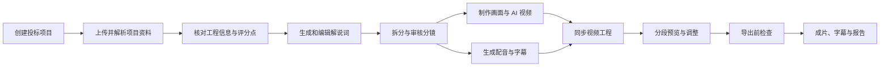

<div align="center">


# 微影 VI studio

### 建设项目影像工作台

面向建筑工程投标场景，将项目资料、工程信息、解说词、分镜、AI 画面、配音与视频制作组织在同一条工作流中。

[](frontend/package.json)
[](frontend/tsconfig.json)
[](backend/requirements.txt)
[](backend/Dockerfile)
[](docker-compose.yml)

[项目定位](#项目定位) · [功能详解](#功能详解) · [使用流程](#使用流程) · [核心数据](#核心数据与版本关系) · [快速开始](#快速开始) · [AI 服务](#ai-服务配置) · [技术架构](#技术架构) · [项目结构](#项目结构)

</div>

---

## 项目定位

**微影 VI studio** 是一套面向建筑工程投标视频的 AI 辅助制作平台。它不是一个只负责“输入一句话、生成一段视频”的单点工具，而是以“投标项目”为基本工作单元，连接项目资料整理、工程信息确认、文案创作、分镜设计、视听素材生成和成片导出的业务工作台。

在传统制作流程中，项目人员通常需要在招标文件、笔记、文稿、图像生成工具、配音工具和视频编辑软件之间反复切换。这种方式不仅消耗时间，也容易出现资料来源丢失、解说词与分镜不同步、新画面没有替换到视频工程、配音已过期但仍被使用等问题。微影 VI studio 将这些内容纳入同一个项目空间，让上游资料的变化可以更清楚地传递到下游制作环节。

系统的最终目标不是替代投标、工程或视频专业人员，而是将重复的资料整理、初稿生成、版本管理和跨环节同步工作结构化。用户仍然保留对工程信息、施工表达、品牌风格、AI 生成结果和最终成片的审核权，系统则提供可编辑、可重试、可选版本的辅助能力。

### 适用场景

微影 VI studio 主要适用于建筑施工企业、投标团队、项目管理团队以及建设项目影像制作人员。它可以用于整理投标项目的基础资料，辅助编写项目概况、施工部署、重难点与保证措施等解说内容，也可以将 BIM 截图、建筑效果图、施工过程图片和其他项目素材组织为演示视频。

除了完整投标视频，平台的分镜、画面制作、AI 视频和配音工作区也可单独用于项目汇报、施工方案演示、项目宣传和阶段性影像内容的前期制作。不过，所有 AI 生成内容都应视为候选素材，而不是未经确认即可直接作为工程依据的结果。

### 产品设计原则

- **项目化组织**：资料、分镜、素材、配音和导出任务都归属于明确的投标项目，避免不同项目的内容互相混用。
- **人工确认优先**：系统可以识别和生成内容，但工程参数、评分点和正式解说词仍然需要用户审核。
- **中间结果可编辑**：解说词、分镜、提示词、配音文本、字幕和视频分段都不是不可修改的黑盒输出。
- **生成结果版本化**：画面、AI 视频、配音和分镜保留可选择或恢复的版本，方便比较与回滚。
- **任务状态可见**：耗时的文档解析、图像生成、视频生成、配音和导出任务均以可查询状态运行，并支持相应的取消或重试操作。

> [!IMPORTANT]
> AI 画面和视频只用于视觉表达。正式对外使用前，请人工核对建筑轮廓、楼层、道路、设备、施工状态、工程参数、配音授权和第三方素材授权。

## 功能详解

### 1. 项目总览与投标项目管理

项目总览是进入微影 VI studio 后的全局工作台。页面会聚合当前账号可访问的投标项目、已归档资料、AI 任务和视频生成记录，并提供“继续上次项目”的快速入口。用户无需记住上一次工作到了哪个页面，可以从总览直接回到最近打开的项目。

总览页还会展示项目推进、任务动态、近期活跃情况和 AI 使用成本估算。成本数据会根据已记录的视频时长、任务用量或模型返回的成本字段进行汇总；页面中使用的计费基准可以由用户调整，但这些数据只用于项目管理和趋势参考，不应当作服务商的正式账单。

投标项目页面支持创建、查看、更新和删除项目。每个项目可以保存名称、描述、招标人、投标截止日期、建筑面积和工期等基本信息。进入项目后，左侧导航会切换为该项目专属的工作区，并允许在已有项目之间快速切换。

**主要操作包括：**

- 创建投标项目并维护项目概况、关键日期与描述。
- 查看每个项目的资料数、分镜数、任务状态和最近进入时间。
- 从“快速开始”引导进入资料上传、工程信息确认和分镜生成。
- 在总览中查看已提交、运行中、完成或失败的 AI 任务。
- 按项目汇总近期生成时长与估算成本，辅助团队掌握使用情况。

### 2. 招标资料、文档解析与在线阅读

招标资料工作区用于建立项目的资料基础。当前支持上传 PDF、DOCX 和 TXT 文件，用户可以根据内容将文件归类为招标文件、施工资料、评分办法或其他资料。上传时会检查文件名和实际文件类型，避免仅修改扩展名的异常文件直接进入解析流程。

对于较大文件，前端会使用分片上传流程。系统可以创建上传会话、查询已完成的分片、上传缺失分片，并在所有分片完成后合并文件和发起解析。如果上传中断，重新选择同一文件时可以根据上传状态继续处理；用户也可以主动取消上传并清理临时分片。

文档进入系统后，后端会保存文档、页面、文本块、目录和解析状态。用户可以在文档阅读器中按页查看提取内容，了解页面是否包含 OCR 结果、表格或解析异常，也可以通过全文搜索定位项目名称、工期、建筑面积、施工方法等关键内容。当分镜引用了某份资料时，阅读器还可以查看引用该文档的分镜，帮助用户从成片表达反查资料依据。

**资料处理能力包括：**

- 普通上传和大文件分片上传，包括进度查询、合并、取消与恢复。
- 文件类型检查、安全文件名处理与项目级资料隔离。
- 按页保存解析文本，查看页面列表、页面详情与页面解析统计。
- 提取和展示文档目录，支持项目资料的全文搜索。
- 对解析失败或内容更新的资料手动发起重新解析。
- 查看文档与分镜的引用关系，避免删除或替换资料时失去对下游内容的判断。

### 3. 工程信息核对与评分点管理

工程信息核对工作区将文档中零散的项目数据整理为可查看、可筛选、可确认的事实记录。这些记录可以包含面积、工期、金额、高度、楼层、关键日期、单体范围和其他项目参数。每条信息不仅保存归一化的值，还可以关联原始资料、页码和上下文文本，让用户在确认一个数字前能够回到其来源位置。

系统不会将所有自动提取结果直接当作最终事实。当多份文档中出现不一致的数值或表述时，对应记录可被列入冲突视图；用户可以选择确认、驳回或修改识别结果，并保存确认备注。这一过程使 AI 生成的解说词能够优先基于已审核内容，降低错误数字进入正式文案的风险。

评分点管理用于记录招标文件或评分办法中与视频表达相关的要求。分镜生成后，系统可以统计评分点覆盖情况，让用户了解哪些主题已经在解说词中体现，哪些内容仍需要补充。覆盖率用于内容自查，不代表实际投标评审结果。

**核对工作包括：**

- 按类型、状态、来源文档和展示范围查看工程信息。
- 单独查看多来源不一致的冲突记录。
- 将识别结果确认为有效信息，或者驳回不可用的提取结果。
- 在人工复核后修改数值、单位、范围和备注。
- 查看评分点列表及其在当前分镜中的覆盖率。

### 4. 解说词、分镜与证据审核

解说词与分镜工作区负责将已确认的项目资料转化为可编辑的视频内容结构。用户可以设定内容目标、视频类型、预期时长和希望重点，由 AI 生成连续解说词并拆分为多个分镜。分镜可以按片头、项目概况、施工部署、项目重难点、施工方案、保证措施和片尾等章节组织，也可由用户手动创建不同类型的镜头。

在长文生成过程中，系统会先组织证据运行结果。用户可以查看当前解说词所使用的工程信息和资料依据，确认后再继续生成，避免未审核的项目数据直接进入后续环节。对已有的连续文稿，用户可以直接修改正文并重建旁白短句节拍，也可以让 AI 根据新的段落结构重新分镜。

每个分镜都是可独立编辑的业务对象。用户可以修改标题、章节、画面描述、解说词、时长、画面类型和关联证据，还可以调整顺序、手动新增、删除或对单个分镜重新生成。分镜每次重要修改都会创建历史记录，用户可以查看人工编辑与 AI 生成的版本，并在需要时恢复旧内容。

页面会同时统计分镜数、总字数、预计总时长、评分点覆盖率和未验证分镜数。这些数据帮助用户从整体视角检查文案的长度与完整性，而不只是逐个镜头编辑。

**内容编辑能力包括：**

- 根据已确认资料生成连续解说词和初始分镜。
- 在生成前查看长文证据运行，由用户审核后继续。
- 编辑连续文稿，保存后重建旁白节拍和字幕断句基础。
- 让 AI 按新的内容重点重新分镜，或只重新生成某一个镜头。
- 手动新增、编辑、删除、重排分镜，并恢复任意历史版本。
- 为分镜选择当前画面版本，或恢复曾经使用的渲染结果。
- 导出当前解说词文稿，作为外部审核或继续编辑的文本。

### 5. 建筑画面制作与版本对比

画面制作工作区面向 BIM 截图、模型截图、建筑效果图和项目参考图的二次制作。用户可以上传源图，记录来源软件、镜头角度、图像尺寸和相关标签，再选择渲染预设、提示词、生成数量和 Provider 创建画面生成任务。源图本身会作为项目素材保存，生成结果则以新版本方式进入版本列表。

渲染预设用于将常用的风格、模型、尺寸、正向提示词和负向约束组合成可复用配置。系统可以提供预置的系统预设，也允许用户创建企业预设、编辑已有预设或复制后调整。这种方式适合将常用的建筑材质、天空、环境、灯光和镜头风格固化为团队配置。

除了常规生成，画面工作区还提供局部重绘、16:9 扩图和清晰度增强。局部重绘需要上传遮罩，用户可以在不重新生成整张画面的情况下尝试修改指定区域；扩图用于将已有图像调整为视频常用的横向比例；清晰度增强则用于生成更高分辨率的候选版本。是否支持某项能力由当前 Provider 的能力矩阵决定，页面会在提交前根据当前配置进行限制或提示。

每次生成都会产生独立的任务与结果版本。用户可以查看任务进度、错误信息和结果列表，对失败任务重试，对运行中任务取消，或将两个任意版本放在对比视图中检查。选定画面后，该版本可以绑定到具体分镜，供 AI 视频或成片工程继续使用。

### 6. AI 视频、提示词大师与模板制作

AI 视频工作区面向基于参考帧的建筑视频生成。用户需要先从项目素材中选择或上传首帧图片，再根据 Provider 能力决定是否增加尾帧或多张参考图。页面会展示当前 Provider、模型、分辨率、时长、帧率、声音生成能力和其他可用参数，用户确认参考帧、镜头提示词和生成配置后再提交任务。

“提示词大师”用于读取已选的参考图和用户的镜头意图，辅助生成视频提示词和结构化施工配方。对于复杂的施工镜头，用户可以进入高级施工工作台，检查主体、动作、阶段、时间、空间锚点、保持项和负向约束等字段。只有在工作台中明确应用的高级配方才会进入本次生成，避免上一次草稿意外影响新任务。

在视频提交前，系统可以对提示词中可能改变建筑主体结构的描述进行约束预检。如果描述可能被模型理解为改变整栋建筑，页面会要求用户确认它是临时支撑、模板或施工工序，而不是一个无意的结构修改指令。确认结果只针对当前任务，不会全局跳过后续检查。

视频模板库用于将经验过的运镜方式、参考帧顺序、提示词和推荐参数保存为可复用配方。除了套用已有模板，用户还可以从一段专业视频或项目素材创建新模板：选择连续镜头、提取关键帧、由 AI 提炼模板名称、用途、提示词和结构化配方，人工编辑后试生成，最后再发布到模板库。

每个视频任务保存提交时的 Provider、模型、参考图、提示词、时长、分辨率和其他参数快照。用户可以查看进度、取消、重试、基于当前版本重新生成，并在同一任务的多个结果中重命名或选择正式版本。成功生成的视频会进入项目素材库，供分镜或视频工程复用。

### 7. 配音、发音词典与字幕时间轴

配音工作区以当前项目的分镜解说词为唯一文本来源，不另外保存一份脱离分镜的文案副本。进入页面时，系统会加载最新解说词、配音模板和 Provider 能力；在提交配音前还会再次读取分镜，如果发现文案刚刚被其他页面修改，则先同步新内容，避免使用旧文本生成音频。

每个分镜都可以设置独立的配音参数，包括音色模板、语速、音量、音调、情绪和目标时长等。页面会根据 Provider 能力禁用其不支持的参数，而不是将无效值继续发送。用户可以先查看预计时长，再生成单个分镜，也可以对项目分镜批量提交配音任务。批量生成会为每个分镜创建独立任务，某一镜头失败不会要求其他镜头全部重做。

发音词典用于处理人名、地名、企业缩写、工程专业词和特殊数字读法。词条可以按系统、企业或项目范围管理，支持新增、修改、删除、测试，也支持批量导入与导出。在生成音频前，系统会对原始解说词进行朗读规范化，将适合展示的书面文本转换为更适合 TTS 的读法，但不会覆盖分镜中用于展示的原始文案。

每次生成会创建独立的音频版本。用户可以试听、查看参数、选择当前正式版本、恢复历史版本或删除不再需要的候选结果。当分镜解说词已经修改时，旧配音会标记为需要重新生成，提醒用户不要在成片中混用旧文案对应的音频。

配音完成后，系统会为音频版本创建字幕句段和时间轴。用户可以编辑每个字幕句段的文本、开始时间和结束时间，再按分镜导出或合并导出项目 SRT。音频也可以按项目导出为 WAV 或 MP3，便于在外部工具中复核或继续制作。

### 8. 配音模板与授权管理

配音模板将 Provider、音色 ID、显示名称、性别、语言、说话风格、默认语速和授权状态组织在一起。系统可以预置公共音色模板，用户也可以创建企业或项目范围的模板，对名称、用途、默认参数和授权备注进行维护。某个模板可以被复制后改造，而不必直接修改系统预置。

模板页面提供音色试听和 Provider 能力查询。对于正式视频，用户应关注音色是否获得充分授权；授权待确认、已拒绝、已过期或状态未知的模板不应用于正式交付，只允许演示的模板也不应被误选为正式音色。授权状态是业务审核的记录，不能替代服务商或音色权利方的实际授权文件。

### 9. 项目素材库

素材库统一管理项目中的图片、视频、音频和模型截图。素材可以由用户上传，也可以由画面生成、AI 视频、配音和视频模板试生成等工作流自动写入。每个素材保存名称、类型、来源、标签、文件位置、生成提示词和必要的媒体信息，便于用户区分“手工上传”和“AI 生成”结果。

素材列表可以按类型、来源和关键词筛选。用户可以预览图片、视频和音频，查看生成参数与提示词，重命名素材、下载原文件或删除不再需要的记录。对于视频素材，后端可以提取起始帧，供模板制作和其他参考图工作流使用。

素材库不只是一个文件上传目录，它还是分镜、画面制作、AI 视频和视频工程之间的素材交换层。当用户在视频工程中更换某个分段的画面时，实际上选择的是当前项目素材库中的图片或视频版本。

### 10. 视频工程、分段合成与导出中心

视频工程是前面各个工作区的汇合环节。用户可以为一个投标项目创建多个视频工程，例如演示版、正式版或面向不同汇报对象的版本。新建工程后，可以将当前分镜同步为视频分段，后续分镜新增、删除或重排时也可以再次同步。

每个视频分段可以选择图片或视频素材，设置时长适配方式、转场、字幕开关、配音版本和其他分段参数。对于静态图片，合成器可以使用平移缩放方式建立视觉运动；对于已有视频，则需要根据分镜时长进行截取、循环或其他适配。用户可以拖动重排分段，也可以对单个分段进行预览、重新合成、失败重试和下载。

背景音乐作为独立音轨管理，不与分段配音混为同一个源文件。用户可以从素材库选择背景音乐，设置全局音量和对应的时间轴。导出时，合成流程会将分段音频、背景音乐和字幕按工程时间轴组装。

在生成整片前，导出前检查会查看分段素材、配音、字幕、任务状态和授权等条件。演示导出与正式导出的检查严格程度不同：演示版主要用于验证页面、时间轴和合成流程，正式导出则会对缺失素材、过期配音、未授权音色和不符合正式交付条件的结果进行更严格的提示或拦截。

导出任务会保存进度、模式、检查结果、输出文件和错误信息。用户可以取消运行中的导出，对失败任务重试，并在完成后下载成片 MP4、独立 SRT 字幕和导出报告。历史导出会保留在导出中心，方便区分不同时间产生的成片。

### 11. 账号、AI 设置与人员管理

账号与 AI 设置页用于维护当前用户信息、查看平台成员以及统一配置 AI Provider。普通用户可以更新自己的基本资料；管理员还可以添加平台人员、停用或恢复账号，并管理人员的管理员权限。停用账号不会自动删除其历史项目和任务记录。

AI 设置将文本、提示词、图像、视频和语音服务拆分为独立配置。管理员可以选择 Provider、模型和服务地址，保存对应 API Key，并让 API 与任务 Worker 使用同一组运行配置。页面返回的 Key 会使用掩码展示，不应将已保存的完整凭证再次暴露给浏览器。

## 使用流程



### 第一阶段：创建项目并明确表达目标

先在投标项目页面建立项目。除了项目名称，建议同时填写招标人、截止日期、建筑面积、工期和项目描述，这些信息不仅用于列表展示，也有助于后续判断资料是否属于当前项目。如果需要同时制作演示版和正式版，可在后期建立多个视频工程，无需为同一建设项目重复建立资料项目。

### 第二阶段：上传资料并检查解析结果

将招标文件、评分办法、施工组织设计、项目概况和其他可供文案参考的资料分类上传。文档解析完成后，先进入阅读器检查关键页，尤其是含有工期、面积、日期、金额和评分标准的页面。如果某份文档解析失败或更换了文件，应先重新解析，再进入工程信息核对。

### 第三阶段：审核工程信息和冲突项

在工程信息核对页面逐项确认重要数据。对于多来源冲突，不建议仅根据数值大小选择，而应打开来源页面，判断它们分别对应招标范围、单体范围、暂估值还是最终值。只有经过确认的数据才适合被写入正式解说词。

### 第四阶段：建立连续文稿和分镜结构

选择视频用途、目标时长和希望重点，生成初稿。先在连续文稿视图中检查整体叙事和用词，再查看分镜。对每个分镜，要同时检查解说词、画面描述、预计时长和证据来源是否一致。如果只需要调整局部，可以编辑或重新生成单个分镜，不必要每次都重建全部内容。

### 第五阶段：为分镜准备视觉素材

对需要稳定展示建筑本体的镜头，可以先在画面制作工作区处理 BIM 截图或项目效果图，比较多个版本后绑定到分镜。对需要运镜、施工过程或时间变化的镜头，再将选定图片作为参考帧提交 AI 视频。生成后要检查建筑结构是否发生不合理变化，并在多个结果中明确选择将要使用的版本。

### 第六阶段：生成配音并校对字幕

在解说词基本定稿后再批量生成配音，可以减少因文案修改而重复调用语音服务。先用发音词典处理人名、地名和专业词，再逐段试听。如果时长与分镜差异较大，优先调整朗读文本、语速或分镜时长，而不是在成片阶段强行拉伸音频。配音完成后继续校对字幕断句与时间轴。

### 第七阶段：组装视频工程并分段预览

创建视频工程并同步当前分镜。为每个分段选择画面或视频素材、配音版本、字幕开关、时长适配和转场。不建议等到所有分段完成后才第一次导出整片；可以先对关键分段单独预览，快速确认字幕、音频和画面适配是否符合预期，再批量处理其余内容。

### 第八阶段：运行预检并完成交付

先使用演示导出验证整条合成链路，再运行正式导出前检查。如果存在缺失素材、过期配音、未处理任务或授权风险，应根据提示回到对应工作区修复。任务完成后，播放完整 MP4，检查开头、结尾、转场、字幕、音量和口型无关的配音同步，并将同一版本的 SRT 与导出报告一并归档。

## 核心数据与版本关系

微影 VI studio 以“项目”为边界组织业务数据。这种设计使一个分镜的解说词、画面、配音和视频分段能够保持关联，同时避免不同投标项目的内容互相污染。对于用户而言，理解下表中的对象与下游关系，有助于判断修改某一环节后需要刷新哪些结果。

| 核心对象 | 保存内容 | 与其他环节的关系 |
| --- | --- | --- |
| 投标项目 | 项目概况、日期、描述和访问归属 | 是资料、分镜、素材、任务和视频工程的归属边界 |
| 来源文档 | 文件类型、解析状态、目录、页面和文本块 | 为工程信息、评分点和分镜证据提供来源 |
| 工程信息 | 数值、单位、状态、原文、页码和人工确认 | 用于生成和审核解说词，冲突状态会影响正式使用 |
| 分镜 | 章节、标题、画面描述、解说词、时长和历史版本 | 为画面绑定、配音、字幕和视频工程分段提供结构 |
| 画面版本 | 源图、预设、提示词、生成参数和结果文件 | 可选择为分镜当前画面，也可作为 AI 视频参考帧 |
| AI 视频版本 | Provider、模型、参考帧、提示词、参数快照和输出文件 | 选定结果会进入素材库，供分镜和视频工程使用 |
| 配音版本 | 朗读文本、音色、语速、音量、音频文件和字幕句段 | 解说词改变后可标记为过期；视频分段可选择指定版本 |
| 视频工程分段 | 分镜映射、画面素材、配音版本、时长、转场和字幕设置 | 独立渲染后组成整片，上游变化时需要重新合成 |
| 导出任务 | 导出模式、进度、预检结果、MP4、SRT 和报告 | 代表某一时点的完整交付结果，可与后续版本并存 |

版本管理的核心原则是“保留候选结果，明确选择当前结果”。生成新画面、新视频或新配音时，系统不需要直接删除旧文件，而是将新结果作为新版本保存。用户在审核后选择某个版本为当前使用结果，下游视频工程再读取该选择。这种方式适合 AI 生成具有不确定性的场景，也便于回顾不同参数对结果的影响。

## 快速开始

### 运行环境

最简单的启动方式是使用 Docker Compose。这种方式会一次启动前端、后端 API、Celery Worker、PostgreSQL、Redis 和 MinIO，适合首次体验和与正式环境较接近的本地测试。启动前请准备 Docker Desktop，或者 Docker Engine 与 Compose v2。

### Docker Compose 启动

```bash
git clone https://github.com/Zicaibucai/VI_studio.git
cd VI_studio
cp .env.example .env
docker compose up -d --build
```

`docker compose up -d --build` 会构建前后端镜像，启动依赖服务，并在数据库、Redis 和 MinIO 通过健康检查后启动 API 与 Worker。后端首次启动时会运行 Alembic 迁移，创建默认管理员，并初始化系统配音模板、发音词典、画面预设和视频模板。

启动完成后可访问：

- Web 工作台：<http://localhost:5173>
- FastAPI 接口文档：<http://localhost:8000/docs>
- MinIO 对象存储控制台：<http://localhost:9001>

演示环境的默认管理员来自 `.env`：

```text
admin@fastvideo.cn / admin123456
```

> [!WARNING]
> 默认账号和示例密码只适用于本地开发。共享或生产部署前，必须修改 `SECRET_KEY`、`ADMIN_PASSWORD`、`POSTGRES_PASSWORD` 和 `MINIO_ROOT_PASSWORD`，并根据实际情况关闭公开注册。

查看容器运行状态：

```bash
docker compose ps
```

查看 API 或 Worker 日志：

```bash
docker compose logs -f api
docker compose logs -f worker
```

停止当前服务：

```bash
docker compose down
```

`docker compose down` 不会默认删除 PostgreSQL、Redis、MinIO 和项目存储卷，因此下次启动时仍然可以读取已有数据。如果需要迁移环境，不能只复制数据库，还需要同步 MinIO 或本地存储中的文档、图片、音频和视频对象。

### 本地开发模式

不使用 Docker 时，建议准备 Python 3.11、Node.js 20+、FFmpeg，并根据是否需要异步任务准备 Redis。为了降低首次调试成本，可以将 `.env` 切换为 SQLite、本地文件存储和同步任务：

```dotenv
DATABASE_URL=sqlite:///./app.db
STORAGE_BACKEND=local
USE_CELERY=false
AI_LLM_PROVIDER=disabled
AI_IMAGE_PROVIDER=disabled
AI_VIDEO_PROVIDER=disabled
AI_TTS_PROVIDER=disabled
```

启动后端：

```bash
python3 -m venv backend/.venv
source backend/.venv/bin/activate
pip install -r backend/requirements.txt
cd backend
alembic upgrade head
python run_dev.py
```

另开一个终端启动前端：

```bash
cd frontend
npm install
npm run dev
```

macOS 本地开发也可以在仓库根目录使用 `./start_dev.sh` 启动 API、Worker 与前端，使用 `./stop_dev.sh` 停止。如果启用 Celery，需要确保 Redis 可访问，并保证 API 与 Worker 加载的数据库、存储和 AI Provider 配置一致。

### 演示模式

对应 AI Provider 设为 `disabled` 时，工厂会返回演示适配器。演示模式可以创建任务、返回状态并产生供页面预览的模拟结果，适合测试项目数据流、任务轮询、版本选择和视频工程绑定。演示模式不代表真实 AI 模型的理解能力、画面质量、生成速度或调用成本，也不应将模拟结果用于正式交付。

## AI 服务配置

### 适配器设计

项目将文本、多模态提示词、图像、视频、语音和 OCR 能力拆分为独立适配器。业务层不直接假设所有服务商具有同样的参数，而是先读取 Provider 能力矩阵，再决定页面中哪些开关、尺寸、参考帧模式、音色参数和任务操作可用。因此，更换 Provider 时不应只替换 Key，还需要检查模型名称、服务地址和当前工作流所需能力是否被新 Provider 支持。

| 能力 | 代表性适配 | 在项目中的用途 |
| --- | --- | --- |
| 文本理解 | Kimi、DeepSeek、OpenAI 兼容接口或 Mock | 工程信息结构化、解说词、分镜和文案重写 |
| 多模态提示词 | Kimi、火山方舟视觉模型或 Mock | 读取建筑参考图，生成视频提示词和施工配方 |
| 图像生成 | Seedream、MiniMax、OpenAI 兼容接口或 Mock | 建筑画面制作、局部重绘、扩图和清晰度增强 |
| 视频生成 | Seedance、MiniMax 或 Mock | 根据首帧、首尾帧或多参考图生成建筑视频 |
| 语音合成 | 火山豆包语音、OpenAI 兼容接口或 Mock | 按分镜生成配音，生成音频版本和字幕时间轴 |
| OCR | Tesseract 或 Mock | 为扫描页或缺少文本层的文档页提取文字 |

### 常用配置示例

以下示例展示文本、图像、视频和语音服务如何分别配置。实际的模型名称、区域、服务地址和凭证类型会随服务商变化，应以当前账号控制台和服务商文档为准。

```dotenv
# 文本与多模态
AI_LLM_PROVIDER=kimi
AI_LLM_MODEL=kimi-k3
AI_PROMPT_MASTER_PROVIDER=kimi
AI_PROMPT_MASTER_MODEL=kimi-k3
KIMI_API_KEY=your_moonshot_key

# 图像生成
AI_IMAGE_PROVIDER=seedream
AI_IMAGE_MODEL=doubao-seedream-4-5-251128
SEEDREAM_API_KEY=your_ark_key

# 视频生成
AI_VIDEO_PROVIDER=seedance
AI_VIDEO_MODEL=doubao-seedance-2-0-260128
ARK_API_KEY=your_ark_key

# 语音合成
AI_TTS_PROVIDER=volcengine
VOLCENGINE_TTS_API_KEY=your_volcengine_tts_key
```

Seedream 和 Seedance 同属火山方舟能力时，可以根据当前账号与接口配置复用 `ARK_API_KEY`。火山豆包语音合成则属于语音技术接口，其 API Key、资源 ID 和音色授权与火山方舟的模型 Key 不是同一类凭证。配置音色 ID 只能决定希望使用的发音人，不能绕过账号凭证、资源开通和授权检查。

完整配置项、默认值与说明见 [`.env.example`](.env.example)。如果在页面中更新 Provider，需要确保 API 和 Celery Worker 都能读取新配置；否则可能出现页面显示新 Provider，但后台任务仍然使用旧配置的情况。

> [!CAUTION]
> 请勿将 `.env`、真实 API Key、数据库密码、MinIO 密码或任何服务商凭证提交到 Git。

## 技术架构

### 架构总览

微影 VI studio 采用前后端分离的 Web 架构。前端负责项目工作区、文档阅读、分镜编辑、素材预览、任务轮询和时间轴交互；后端负责认证、项目数据、文档解析、AI 适配、媒体处理、对象存储和异步任务。数据库保存业务元数据和对象关系，文档、图片、音频与视频文件则保存在 MinIO 或本地存储中。

| 层级 | 主要技术 | 责任 |
| --- | --- | --- |
| Web 前端 | React 18、TypeScript、Vite、Ant Design、Axios、React Router | 页面导航、表单编辑、任务轮询、媒体预览与项目工作区交互 |
| API 服务 | Python 3.11、FastAPI、Pydantic | 认证、业务接口、参数校验、异常处理与 OpenAPI 文档 |
| 数据持久化 | SQLAlchemy、Alembic、PostgreSQL / SQLite | 业务对象、版本关系、任务状态与数据库迁移 |
| 异步任务 | Celery、Redis、同步线程池降级 | 文档解析、AI 生成、配音、分段渲染与整片导出 |
| 文件存储 | MinIO / S3 兼容存储、本地文件系统 | 保存原始资料、画面、音频、视频和导出文件 |
| 文档处理 | pypdf、pdfplumber、python-docx、Tesseract | 文本、页面、表格、目录与 OCR 内容提取 |
| 媒体处理 | FFmpeg、MoviePy、Pillow、ASS / SRT | 图像处理、音频适配、字幕烧录、分段合成与成片导出 |
| 部署 | Docker Compose、Nginx | 本地一键启动、前端静态资源和 API 代理 |

### 异步任务与状态管理

文档解析、图像生成、AI 视频、配音和媒体导出都可能耗时较长，因此系统将这些操作建模为任务。任务记录保存类型、状态、进度、输入快照、输出结果和错误信息，前端通过轮询查看最新状态。使用 Celery 时，任务由 Worker 从 Redis 队列获取；在本地简化配置中，则可以使用同步或线程池方式执行。

取消和重试不只是前端按钮状态。后端会检查任务当前是否允许进行相应转换，并为重试任务保留必要的输入参数。对于可能产生外部付费调用的 AI 任务，用户在重试前应检查失败原因，避免在凭证、参数或素材未修复的情况下重复调用。

### 存储与数据一致性

数据库中的素材记录只保存元数据和文件引用，真正的二进制文件存放在 MinIO 或本地存储中。因此，备份、迁移和恢复时必须同时考虑数据库与文件对象。如果只恢复数据库，页面仍可能显示素材名称和记录，但预览或下载时会因对象缺失而失败。

## 项目结构

仓库按后端业务服务、前端工作区与部署配置组织。后端内部将 AI 适配、接口、数据模型、业务服务和异步任务分开，便于在更换 Provider 或扩展业务页面时保持边界清晰。前端以业务页面为主，通用任务状态、通知中心和编辑组件则放在独立组件目录中。

```text
VI_studio/
├── backend/
│   ├── app/
│   │   ├── adapters/       # LLM、图像、视频、TTS 与 OCR 适配器
│   │   ├── api/v1/         # 认证、项目、资料、分镜、素材和视频等 API
│   │   ├── core/           # 配置、数据库、安全、日志与存储
│   │   ├── models/         # SQLAlchemy 数据模型
│   │   ├── schemas/        # Pydantic 请求与响应结构
│   │   ├── services/       # 文档、文案、提示词、配音与媒体服务
│   │   └── tasks/          # Celery 文档解析、生成、渲染与导出任务
│   ├── alembic/            # 数据库迁移脚本
│   ├── tests/              # 后端接口、服务与任务测试
│   ├── Dockerfile
│   ├── requirements.txt
│   └── run_dev.py
├── frontend/
│   ├── src/
│   │   ├── api/            # Axios 客户端、业务接口和 TypeScript 类型
│   │   ├── components/     # 通用布局、通知、任务状态和编辑组件
│   │   ├── data/           # 施工配方等前端示例数据
│   │   ├── hooks/          # AI 视频等页面数据 Hook
│   │   ├── pages/          # 项目、文档、分镜、画面、配音和视频页面
│   │   ├── stores/         # 认证等全局状态
│   │   └── utils/          # 页面草稿与辅助工具
│   ├── Dockerfile
│   ├── nginx.conf
│   ├── package.json
│   └── vite.config.ts
├── docs/                    # README 封面等文档视觉资源
├── docker-compose.yml        # 完整本地服务编排
├── .env.example              # 环境变量模板
├── pyproject.toml            # Pytest、Ruff 与 Coverage 配置
├── start_dev.sh              # macOS 本地开发启动脚本
├── stop_dev.sh               # macOS 本地开发停止脚本
└── README.md
```

## 开发、测试与构建

后端测试覆盖 API、业务服务、适配器契约、任务状态和媒体处理等内容。默认 Pytest 配置位于仓库根目录的 `pyproject.toml`，一部分需要 Redis、Celery Worker 或其他外部服务的测试会使用 `integration` 标记。前端使用 Vitest 和 Testing Library 检查组件与 Hook，生产构建会先运行 TypeScript 项目检查，再由 Vite 生成静态资源。

运行后端测试：

```bash
cd backend
pytest -q
```

运行前端测试：

```bash
cd frontend
npm test
```

执行前端类型检查与生产构建：

```bash
cd frontend
npm run build
```

执行后端基础静态检查：

```bash
ruff check backend/app backend/tests
```

真实的图像、视频和语音 Provider 可能产生费用，也可能受账号额度、区域、内容审核和队列繁忙程度影响。自动测试应优先使用 Mock 或 HTTP 契约替身，不应在每次本地构建或 CI 中默认发起付费生成。

## 安全与生产部署

当前 Web 登录态使用 HttpOnly Cookie，以减少浏览器脚本直接读取会话凭证的风险。对携带登录 Cookie 的状态修改请求，后端会检查 `Origin` 是否在配置的前端来源列表中。文件上传同时检查扩展名和文件头，并对文件名、存储 Key 和项目归属进行限制。

生产环境至少应完成以下配置：

```dotenv
APP_ENV=production
DEBUG=false
AUTH_COOKIE_SECURE=true
ALLOW_PUBLIC_REGISTRATION=false
```

此外还应通过 HTTPS 暴露服务，为所有数据库、存储、管理员和应用密钥设置唯一且高强度的值，配置明确的跨域白名单，并建立 PostgreSQL、MinIO、日志和导出文件的备份与恢复方案。如果更换用于加密 Provider Key 的应用密钥，需要同时规划已有凭证的迁移或重新录入。

## 使用边界与发布说明

- **工程信息边界**：文档解析和工程信息提取只能辅助整理资料，不能替代招标文件原文、图纸、BIM 模型、工程量清单和专业审核。
- **AI 生成边界**：图像和视频模型可能改变立面细节、建筑结构、道路关系、设备数量和施工状态。提示词约束可以降低风险，但不能保证几何与工程事实完全一致。
- **服务商边界**：真实 Provider 的模型名称、参数、价格、调用限制、账号区域和内容审核规则可能变化，以服务商当前控制台和文档为准。
- **音色授权边界**：配音模板中的授权状态只是项目内的管理记录，对外发布时仍需要保存实际授权文件，并遵守服务商和声音权利方的规则。
- **媒体交付边界**：导出任务成功只代表技术合成完成，不代表内容已通过投标、品牌、法务和版权审查。

仓库中一部分 `fastvideo` 服务名、数据库名和历史环境变量为了保持已有部署兼容而继续保留；项目对外名称统一为 **微影 VI studio**。对外发布仓库中的第三方样片、模板预览或其他素材前，请阅读 [THIRD_PARTY_ASSETS.md](THIRD_PARTY_ASSETS.md) 并完成相应的授权确认、替换或移除。

---

<div align="center">

**微影 VI studio · 让项目资料、视听创作与投标视频交付连接成一条清晰的工作流。**

</div>
