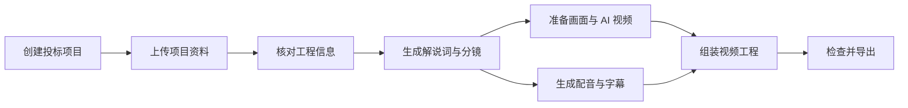

<div align="center">


# 微影 VI studio

### 建设项目影像工作台

面向建筑工程投标场景，将项目资料、解说词、分镜、AI 画面、配音与视频制作放在同一个工作流中。

[](frontend/package.json)
[](frontend/tsconfig.json)
[](backend/requirements.txt)
[](backend/Dockerfile)
[](docker-compose.yml)

[功能概览](#功能概览) · [使用流程](#使用流程) · [快速开始](#快速开始) · [AI 服务](#ai-服务) · [项目结构](#项目结构)

</div>

---

## 项目介绍

**微影 VI studio** 是一套面向建筑工程投标视频的 AI 辅助制作平台。它以“投标项目”为核心，帮助用户整理项目文件、核对工程信息、编辑解说词与分镜，并继续完成画面、AI 视频、配音、字幕和成片导出。

项目的重点是串联投标视频的完整制作过程，减少在文档、AI 生成工具和视频编辑软件之间反复切换。它不是通用视频剪辑器，而是围绕建筑项目资料和投标表达设计的业务工作台。

> [!NOTE]
> AI 用于辅助理解资料和生成视听内容。工程参数、施工表达和最终成片仍应由专业人员审核。

## 功能概览

| 工作区 | 主要功能 |
| --- | --- |
| 项目管理 | 创建和管理投标项目，查看资料、任务进度与 AI 使用情况 |
| 招标资料 | 上传 PDF、DOCX 或 TXT 文件，在线阅读解析内容 |
| 工程信息核对 | 整理项目概况和关键数字，保留对应的资料来源，便于人工确认 |
| 解说词与分镜 | 辅助生成解说词，拆分和编辑分镜，管理镜头顺序与历史版本 |
| 画面与 AI 视频 | 上传建筑或 BIM 参考图，制作画面版本，根据参考帧和提示词生成视频 |
| 配音与字幕 | 按分镜生成和管理配音，调整朗读文本，维护字幕时间轴 |
| 素材与视频工程 | 统一管理图片、视频和音频素材，组织分段、背景音乐和字幕后导出成片 |

## 使用流程



推荐使用顺序：

1. 创建投标项目，录入基本信息。
2. 上传招标文件、施工资料和评分办法。
3. 查看文档解析结果，对系统识别的工程信息进行确认或修正。
4. 生成解说词和分镜，根据项目表达需求进行人工编辑。
5. 为分镜准备图片、AI 视频、配音和字幕。
6. 在视频工程中检查分段、时长和背景音乐，完成后导出。

## 快速开始

### 使用 Docker Compose

需要安装 Docker Desktop，或 Docker Engine 与 Compose v2。

```bash
git clone https://github.com/Zicaibucai/VI_studio.git
cd VI_studio
cp .env.example .env
docker compose up -d --build
```

启动后可访问：

- Web 工作台：<http://localhost:5173>
- API 文档：<http://localhost:8000/docs>
- MinIO 控制台：<http://localhost:9001>

演示环境的默认管理员信息来自 `.env`：

```text
admin@fastvideo.cn / admin123456
```

> [!WARNING]
> 默认账号和示例密码仅用于本地开发。在共享或生产环境启动前，请先修改 `.env` 中的密钥、管理员密码、数据库密码和 MinIO 密码。

查看运行状态或停止服务：

```bash
docker compose ps
docker compose down
```

### 本地开发

建议使用 Python 3.11、Node.js 20+ 和 FFmpeg。如果暂时不需要 Redis / Celery，可在 `.env` 中使用 SQLite、本地文件存储和同步任务：

```dotenv
DATABASE_URL=sqlite:///./app.db
STORAGE_BACKEND=local
USE_CELERY=false
AI_LLM_PROVIDER=disabled
AI_IMAGE_PROVIDER=disabled
AI_VIDEO_PROVIDER=disabled
AI_TTS_PROVIDER=disabled
```

启动后端：

```bash
python3 -m venv backend/.venv
source backend/.venv/bin/activate
pip install -r backend/requirements.txt
cd backend
alembic upgrade head
python run_dev.py
```

另开一个终端启动前端：

```bash
cd frontend
npm install
npm run dev
```

macOS 本地开发也可使用 `./start_dev.sh` 启动 API、Worker 和前端，使用 `./stop_dev.sh` 停止。

## AI 服务

项目将文本、图像、视频和语音能力分别封装，可通过 `.env` 或页面中的“账号与 AI 设置”配置。

| 能力 | 当前适配 |
| --- | --- |
| 文本理解与提示词 | Kimi、DeepSeek、OpenAI 或演示模式 |
| 图像生成 | Seedream 或演示模式 |
| 视频生成 | Seedance、MiniMax 或演示模式 |
| 语音合成 | 火山豆包语音、OpenAI 或演示模式 |

没有配置付费服务时，可将对应的 Provider 设为 `disabled` 使用演示模式，用于体验页面和验证工作流。演示结果不代表真实模型效果。

常用配置项可参考 [`.env.example`](.env.example)。请勿将真实 API Key 提交到 Git。

## 技术架构

| 层级 | 技术 |
| --- | --- |
| 前端 | React 18、TypeScript、Vite、Ant Design |
| 后端 | FastAPI、Pydantic、SQLAlchemy、Alembic |
| 数据与任务 | PostgreSQL / SQLite、Redis、Celery |
| 文件存储 | MinIO 或本地文件系统 |
| 媒体处理 | FFmpeg、MoviePy、Pillow |
| 部署 | Docker Compose、Nginx |

## 项目结构

```text
VI_studio/
├── backend/
│   ├── app/
│   │   ├── adapters/       # AI 服务适配
│   │   ├── api/v1/         # FastAPI 接口
│   │   ├── core/           # 配置、数据库、安全与存储
│   │   ├── models/         # 数据模型
│   │   ├── services/       # 业务与媒体处理
│   │   └── tasks/          # 异步任务
│   ├── alembic/            # 数据库迁移
│   └── tests/              # 后端测试
├── frontend/
│   └── src/
│       ├── api/            # API 客户端与类型
│       ├── components/     # 通用组件
│       ├── pages/          # 业务页面
│       └── stores/         # 前端状态
├── docs/                    # README 视觉资源
├── docker-compose.yml
├── .env.example
└── README.md
```

## 开发检查

```bash
# 后端测试
cd backend
pytest -q

# 前端测试与构建
cd frontend
npm test
npm run build
```

## 使用说明

- 仓库中的一部分 `fastvideo` 服务名、数据库名和环境变量用于保持旧版部署兼容；项目对外名称统一为 **微影 VI studio**。
- 真实 AI 服务需要自行申请 API 凭证，可用性、价格与生成效果以相应服务商为准。
- 对外发布第三方样片或素材前，请查看 [THIRD_PARTY_ASSETS.md](THIRD_PARTY_ASSETS.md) 并确认授权。

---

<div align="center">

**微影 VI studio · 让建筑投标视频制作更连贯、更清晰。**

</div>
